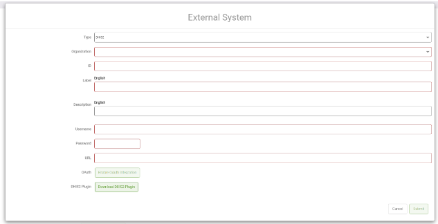

# 3.7.4. Register the implementations with the Java Services architecture

Create the following text files inside the META-INF/services folder of your resources directory:

1. _net.geoprism.registry.etl.fhir.FhirDataPopulator_
2. _net.geoprism.registry.etl.fhir.FhirResourceProcessor_

<figure><figcaption></figcaption></figure>

The contents of each text file should be the fully qualified name of the implementation:

```
com.terraframe.demo.DemoFhirDataPopulator
```

and

```
com.terraframe.demo.DemoFhirResourceProcessor
```

For more information on the Java services architecture see [ServiceLoader (Java Platform SE 8)](https://docs.oracle.com/javase/8/docs/api/java/util/ServiceLoader.html).
