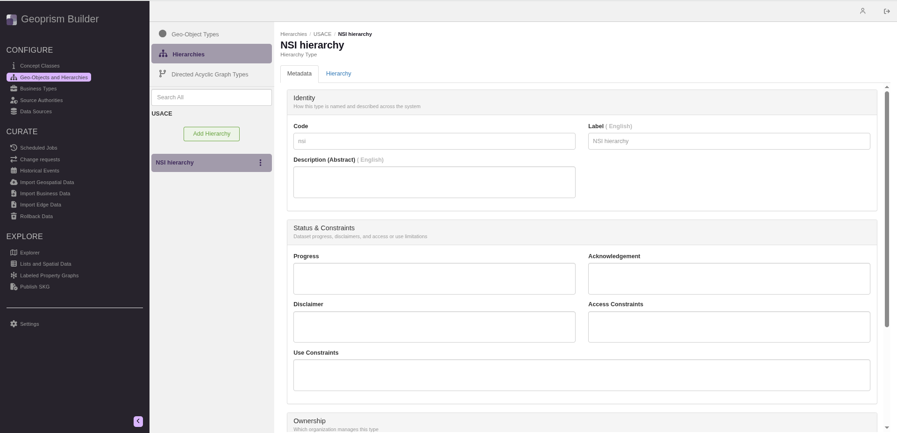

# Editing the metadata of a hierarchy


Registry Administrators can edit metadata for hierarchies for the organization they are a part of.


1.  Navigate to the **Geo-Objects and Hierarchies** page from the sidebar and select **Hierarchies** at the top of the list.

    <figure><figcaption></figcaption></figure>
2.  Click the three-dot menu next to the hierarchy and select **Edit**.

    <figure><figcaption></figcaption></figure>
3.  Click the **Metadata** tab if it isn't already selected. Edit the hierarchy's metadata as needed. The code and organization can't be changed. See [add-a-hierarchy.md](add-a-hierarchy.md "mention") for details of each field.
4.  Click **Close**.

    <figure><figcaption></figcaption></figure>
5.  A message says **You have unsaved changes**. Click **Save changes and close**.

    <figure><figcaption></figcaption></figure>
